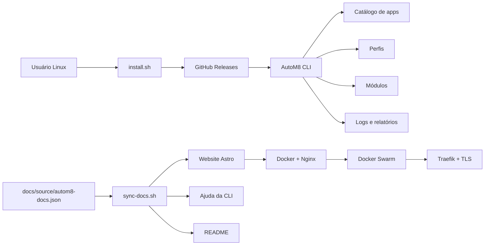

<!--
  Este arquivo é gerado por scripts/sync-docs.sh.
  Atualize docs/source/autom8-docs.json, os catálogos
  ou o bloco DOCS:README do gerador.
-->

<p align="center">
  <a href="https://autom8.oslabs.com.br">
    
  </a>
</p>

<p align="center">
  <strong>Automação Linux local, auditável e previsível para desktops e servidores.</strong>
</p>

<p align="center">
  AutoM8 é uma CLI local para instalar aplicativos, aplicar perfis e executar manutenção em desktops e servidores Linux com confirmações, logs e modo de simulação.
</p>

<p align="center">
  <a href="https://autom8.oslabs.com.br">
    
  </a>
  <a href="https://autom8.oslabs.com.br/docs">
    
  </a>
  <a href="https://autom8.oslabs.com.br/install">
    
  </a>
  <a href="https://github.com/mdmjunior/autom8/releases">
    
  </a>
</p>

<p align="center">
  
  
  
  
  <a href="LICENSE">
    
  </a>
  <a href="https://github.com/mdmjunior/autom8/actions/workflows/quality.yml">
    
  </a>
</p>

---

## AutoM8 em números

<table align="center">
  <tr>
    <td align="center" width="25%">
      <strong>0.2.0</strong><br />
      <sub>versão estável</sub>
    </td>
    <td align="center" width="25%">
      <strong>76</strong><br />
      <sub>aplicativos</sub>
    </td>
    <td align="center" width="25%">
      <strong>10</strong><br />
      <sub>categorias</sub>
    </td>
    <td align="center" width="25%">
      <strong>6</strong><br />
      <sub>perfis</sub>
    </td>
  </tr>
</table>

## Instalação

Execute como usuário comum com permissão de `sudo`:

```bash
curl -fsSL https://autom8.oslabs.com.br/install.sh | bash
```

Primeiro uso:

```bash
export PATH="/opt/autom8/bin:$PATH"
autom8
autom8 doctor
autom8 apps search docker
autom8 profiles list
```

> [!IMPORTANT]
> Não execute o instalador diretamente como `root`.
> A instalação padrão é feita em `/opt/autom8`.

## Por que AutoM8?

| Local e auditável | Seguro por padrão | Multidistro |
| --- | --- | --- |
| Funciona localmente, sem painel remoto obrigatório. | Confirmações explícitas antes de alterações reais. | Fluxos para `apt`, `dnf`, `zypper` e `pacman`. |
| Logs e relatórios permanecem sob controle do usuário. | Modo `--dry-run` para visualizar ações antecipadamente. | Direcionado a desktops e servidores Linux. |
| Diagnósticos privados podem ser sanitizados. | Catálogos locais e atualizáveis. | Ubuntu e Fedora validados no ciclo atual. |

## Experiência no terminal

```console
$ autom8 doctor

AutoM8 · diagnóstico

  ✓ Instalação validada
  ✓ Dependências disponíveis
  ✓ Catálogo carregado
  ✓ Versão estável: 0.2.0

$ autom8 apps search docker

  docker · Containers e ambientes isolados
  docker-compose · Orquestração local

$ autom8 profiles list

  desenvolvimento
  produtividade
  servidor
```

## Stack do projeto

### CLI e runtime

<p>
  
  
  
  
</p>

### Website

<p>
  
  
  
  
</p>

### Infraestrutura e entrega

<p>
  
  
  
  
  
  
</p>

## Arquitetura



> O website publica o instalador e a documentação.
> Os pacotes estáveis da suíte são distribuídos exclusivamente
> pelo GitHub Releases.

## Recursos

| Comando | Estado | Desde | Descrição |
| --- | --- | --- | --- |
| `autom8 apps` | 🟢 Disponível | `0.2.0` | Instala e remove aplicativos por catálogo local atualizável online. |
| `autom8 backup` | ⚪ Planejado | `0.3.0` | Backups simples antes de operações sensíveis. |
| `autom8 clean` | 🟢 Disponível | `0.1.1` | Executa limpeza segura com confirmação explícita. |
| `autom8 config` | 🟢 Disponível | `0.1.1` | Permite alterar configurações básicas da suíte. |
| `autom8 diagnose` | 🟢 Disponível | `0.1.1` | Gera diagnóstico completo local ou privado sanitizado. |
| `autom8 docker` | 🟢 Disponível | `0.1.1` | Mostra informações do Docker quando disponível. |
| `autom8 doctor` | 🟢 Disponível | `0.1.1` | Valida instalação, dependências, PATH, release e versão online. |
| `autom8` | 🟢 Disponível | `0.1.1` | Abre Dashboard + Menu. |
| `autom8 profiles` | 🟢 Disponível | `0.2.0` | Lista, detalha, instala e remove perfis baseados no catálogo de apps. |
| `autom8 report` | 🟢 Disponível | `0.1.1` | Lista e exporta relatórios gerados. |
| `autom8 security` | 🟢 Disponível | `0.1.1` | Executa checagem básica de segurança local. |
| `autom8 self-update` | 🟡 Parcial | `0.1.0` | Valida o pacote estável mais recente publicado no GitHub Releases. |
| `autom8 update` | 🟢 Disponível | `0.1.1` | Atualiza repositórios e pacotes do sistema com confirmação. |
| `autom8 upgrade-distro` | ⚪ Planejado | `future` | Preparação futura para upgrade de versão da distro. |
| `autom8 users` | 🟢 Disponível | `0.1.1` | Lista usuários locais e grupos administrativos. |
| `autom8 --version` | 🟢 Disponível | `0.1.1` | Mostra a versão instalada. |

## Compatibilidade

| Plataforma | Estado atual | Gerenciador |
| --- | --- | --- |
| Ubuntu Desktop | 🟢 Validado | `apt` |
| Fedora Workstation | 🟢 Validado | `dnf` |
| Debian e derivados | 🟡 Compatível, testes em expansão | `apt` |
| openSUSE | 🟡 Compatível, testes em expansão | `zypper` |
| Arch Linux e derivados | 🟡 Compatível, testes em expansão | `pacman` |

## Comandos essenciais

| Comando | Descrição |
| --- | --- |
| `autom8 apps` | Instala e remove aplicativos por catálogo local atualizável online. |
| `autom8 profiles` | Lista, detalha, instala e remove perfis baseados no catálogo de apps. |
| `autom8 update` | Atualiza repositórios e pacotes do sistema com confirmação. |
| `autom8 clean` | Executa limpeza segura com confirmação explícita. |
| `autom8 doctor` | Valida instalação, dependências, PATH, release e versão online. |
| `autom8 diagnose` | Gera diagnóstico completo local ou privado sanitizado. |
| `autom8 security` | Executa checagem básica de segurança local. |
| `autom8 report` | Lista e exporta relatórios gerados. |

Use `autom8 help` para a lista completa e
`autom8 help <comando>` para detalhes.

## Desenvolvimento

```bash
git checkout develop
./scripts/bootstrap-dev.sh
./scripts/sync-docs.sh
./scripts/check.sh all
./scripts/website/build.sh
```

Mudanças entram em `develop` e são promovidas para `main`
por Pull Request com Quality Gate obrigatório.

## Estrutura do repositório

```text
autom8/
├── suite/       # CLI instalada em /opt/autom8
├── installer/   # instalador público
├── site/        # website Astro
├── docs/        # documentação e fonte canônica
├── infra/       # Docker Swarm e deploy
└── scripts/     # build, validação, pacote e release
```

## Documentação

- [Índice técnico](docs/README.md)
- [Arquitetura](docs/ARCHITECTURE.md)
- [Deploy](docs/DEPLOY.md)
- [Releases](docs/RELEASES.md)
- [Variáveis](docs/VARIABLES.md)
- [Como contribuir](CONTRIBUTING.md)
- [Segurança](SECURITY.md)

A fonte canônica é `docs/source/autom8-docs.json`.
O README, os dados do website e a ajuda da CLI são
sincronizados por `scripts/sync-docs.sh`.

## Roadmap

1. concluir `autom8 self-update`;
2. ampliar os testes multidistro;
3. implementar `autom8 backup`;
4. adicionar rollback antes de operações sensíveis;
5. fortalecer a cadeia de releases com checksum e SBOM.

Acompanhe a visão completa no
[roadmap oficial](https://autom8.oslabs.com.br/roadmap).

## Licença

Distribuído sob a [GNU GPL-3.0](LICENSE).

---

<p align="center">
  
</p>

<p align="center">
  <strong>AutoM8</strong><br />
  Um produto OSLabs para a comunidade Linux.
</p>
