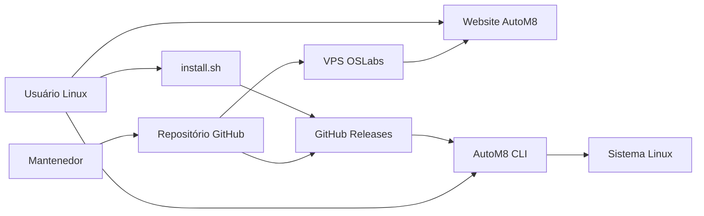
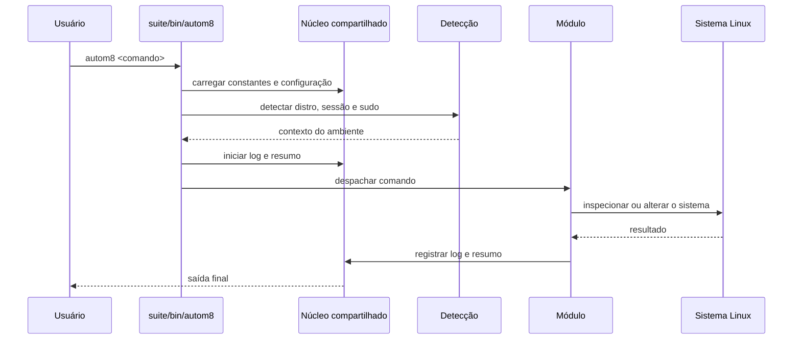
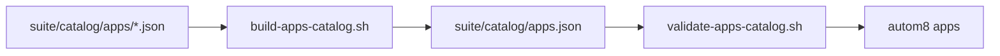
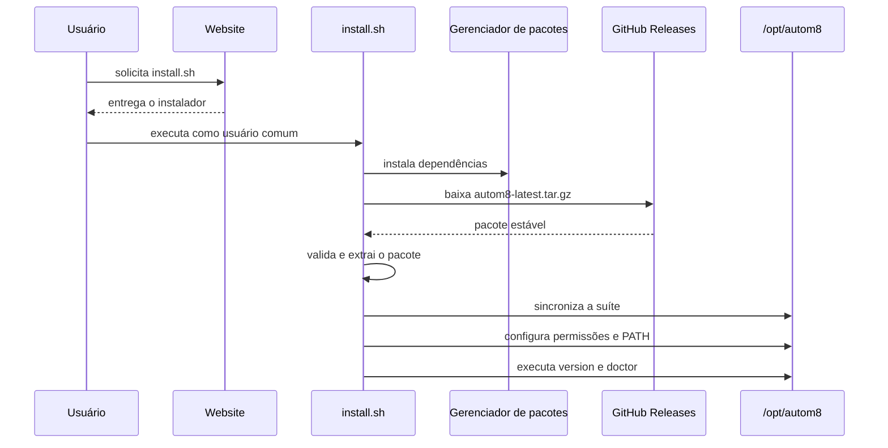
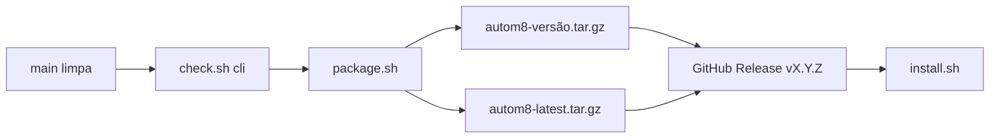
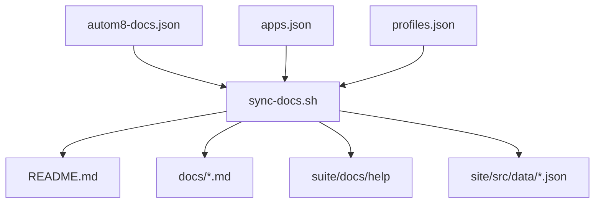

# Arquitetura do AutoM8

Este documento descreve a arquitetura técnica do AutoM8,
os fluxos de execução, distribuição, documentação e publicação.

## Princípios arquiteturais

O projeto é orientado pelos seguintes princípios:

- execução local, sem painel remoto obrigatório;
- operações explícitas e auditáveis;
- suporte a modo de simulação antes de alterações reais;
- separação entre CLI, instalador, website e infraestrutura;
- documentação derivada de uma fonte canônica;
- pacotes estáveis distribuídos exclusivamente pelo GitHub Releases;
- deploy do website com imagem imutável, healthcheck e rollback;
- compatibilidade progressiva com múltiplas famílias Linux.

## Visão geral do repositório

| Diretório | Responsabilidade |
| --- | --- |
| `suite/` | Runtime da CLI instalado em `/opt/autom8`. |
| `suite/bin/` | Entrypoint executável da suíte. |
| `suite/core/` | Configuração, detecção, logs, UI, sudo, ajuda e resumos. |
| `suite/modules/` | Funcionalidades executáveis da CLI. |
| `suite/catalog/` | Catálogos consolidados de aplicativos e perfis. |
| `installer/` | Instalador público e fluxo de preparação do sistema. |
| `site/` | Website institucional e documentação pública em Astro. |
| `docs/` | Documentos técnicos e fonte canônica de conteúdo. |
| `scripts/` | Sincronização, validação, build, pacote, release e deploy. |
| `infra/` | Definições Docker, Swarm, Nginx e publicação do website. |
| `.github/workflows/` | Quality Gates e automações do repositório. |

## Diagrama de contexto



## Runtime da CLI

O entrypoint principal fica em `suite/bin/autom8`.

Na inicialização, ele determina `AUTOM8_ROOT` e carrega
os componentes compartilhados do diretório `suite/core/`:

- `constants.sh`: caminhos, versão e constantes globais;
- `config.sh`: leitura e normalização das configurações;
- `logger.sh`: criação e gravação dos logs;
- `ui.sh`: interface textual e integração com `gum`;
- `detect.sh`: identificação da distribuição e do ambiente;
- `sudo.sh`: validação e execução de operações privilegiadas;
- `summary.sh`: resumo das ações executadas;
- `help.sh`: índice e ajuda detalhada dos comandos.

Depois do núcleo, o entrypoint carrega os módulos funcionais
disponíveis em `suite/modules/`.

Os módulos são carregados no mesmo processo Bash e expõem
funções que são despachadas pelo menu ou pela linha de comando.

### Fluxo de inicialização



### Modos de execução

A CLI possui dois modos principais de interação:

1. menu interativo, iniciado com `autom8`;
2. execução direta, como `autom8 doctor` ou `autom8 apps list`.

Flags globais são interpretadas antes do despacho do comando.
Entre elas estão:

- `--dry-run`: apresenta a ação sem aplicar a alteração real;
- `--private`: sanitiza dados sensíveis em diagnósticos compatíveis;
- `--version`: exibe a versão atual;
- `--help`: apresenta o índice de ajuda.

## Núcleo compartilhado

O núcleo evita que cada módulo implemente novamente funções
de detecção, confirmação, privilégio, logs e apresentação.

Essa separação permite que um módulo se concentre em três etapas:

1. validar se a operação pode ser executada;
2. montar e apresentar as ações previstas;
3. executar, registrar e resumir o resultado.

## Módulos

Os módulos atualmente carregados pelo entrypoint incluem:

- diagnóstico e doctor;
- atualização e limpeza;
- aplicativos e perfis;
- segurança e Docker;
- usuários e configurações;
- relatórios;
- backup e upgrade de distribuição em evolução;
- validação de atualização da própria suíte.

Módulos podem estar nos estados `available`, `partial` ou `planned`.
O estado público de cada comando vem da fonte canônica de documentação.

## Dados e estado local

A instalação padrão usa `/opt/autom8`.

```text
/opt/autom8/
├── bin/        # executável principal
├── core/       # núcleo compartilhado
├── modules/    # módulos funcionais
├── catalog/    # catálogos consolidados
├── config/     # configuração da instalação
├── docs/       # ajuda local
├── logs/       # registros de execução
├── reports/    # relatórios gerados
├── backups/    # backups futuros ou operacionais
└── tmp/        # arquivos temporários controlados
```

O código instalado pertence a `root:root`.
Os diretórios operacionais que precisam receber escrita do usuário
são preparados separadamente pelo instalador.

## Catálogo de aplicativos

O catálogo de aplicativos possui duas camadas:

1. arquivos fonte separados por categoria;
2. catálogo consolidado consumido pela CLI.



O catálogo consolidado é validado antes da criação de pacotes.
Perfis utilizam `suite/catalog/profiles.json` e referenciam
aplicativos presentes no catálogo.

## Instalação

O instalador público fica em `installer/install.sh` e é executado
por um usuário comum com acesso a `sudo`.

### Responsabilidades do instalador

- impedir execução direta como `root`;
- validar autenticação com `sudo`;
- detectar o sistema e o gerenciador de pacotes;
- instalar dependências comuns;
- instalar e validar `gum`;
- baixar o pacote estável pelo GitHub Releases;
- validar se o arquivo baixado é um `tar.gz` válido;
- localizar a raiz correta da suíte dentro do pacote;
- sincronizar os arquivos para `/opt/autom8`;
- configurar permissões e diretórios operacionais;
- disponibilizar o comando no `PATH`;
- executar `autom8 --version` e `autom8 doctor`.

### Fluxo de instalação



O website não hospeda o pacote completo da suíte.
Ele publica o instalador e a documentação pública.

## Empacotamento

`scripts/package.sh` gera dois arquivos temporários:

- `autom8-<versão>.tar.gz`;
- `autom8-latest.tar.gz`.

Antes de empacotar, o script:

- lê a versão em `suite/VERSION`;
- reconstrói o catálogo consolidado;
- valida os catálogos de aplicativos e perfis;
- exclui logs, relatórios, backups e temporários do pacote.

Os arquivos gerados não são copiados para o website,
para a VPS nem para o diretório do repositório.

## Releases

Releases estáveis são publicadas por `scripts/release-stable.sh`.

O fluxo exige:

- árvore Git limpa;
- branch `main`;
- GitHub CLI autenticado;
- validação completa da CLI;
- versão válida em `suite/VERSION`.



Se a release da versão já existir, seus assets podem ser
substituídos explicitamente pelo fluxo de publicação.

## Documentação canônica

A fonte principal de conteúdo é:

`docs/source/autom8-docs.json`

Ela é combinada com os catálogos pelo script
`scripts/sync-docs.sh`.

### Saídas da sincronização

- README visual do repositório;
- documentação técnica em `docs/`;
- arquivos de ajuda da CLI;
- dados estruturados consumidos pelo website;
- catálogo resumido, roadmap e changelog;
- sessões de terminal usadas na apresentação pública.



Arquivos gerados não devem ser editados isoladamente.
A fonte ou o gerador correspondente deve ser atualizado primeiro.

## Website

O website fica em `site/` e utiliza:

- Astro para geração das páginas;
- Tailwind CSS para a camada utilitária de estilos;
- Simple Icons para marcas e integrações visuais;
- Node.js 22 no fluxo de desenvolvimento e build;
- Nginx para servir a saída estática em produção.

O build gera páginas estáticas, metadados SEO, sitemap,
robots.txt e web manifest.

Uma auditoria pós-build valida HTML, links, SEO e acessibilidade.

## Publicação do website

O website é empacotado em uma imagem Docker e publicado
como serviço de uma Stack Docker Swarm.

```mermaid
flowchart LR
    Main[Branch main]
    Build[Build Astro]
    Audit[Auditoria do site]
    Image[Imagem Docker imutável]
    Test[Teste local da imagem]
    Swarm[Docker Swarm]
    Traefik[Traefik + TLS]
    Public[autom8.oslabs.com.br]

    Main --> Build
    Build --> Audit
    Audit --> Image
    Image --> Test
    Test --> Swarm
    Swarm --> Traefik
    Traefik --> Public
```



A imagem recebe uma tag composta pela versão da suíte
e pelo commit Git que originou a publicação.

O serviço utiliza:

- atualização `start-first`;
- uma réplica por padrão;
- healthcheck HTTP;
- espera ativa durante a publicação;
- rollback automático quando a atualização falha;
- rede externa compartilhada `oslabs-public`;
- roteamento HTTPS realizado pelo Traefik.

## Quality Gate

Mudanças entram pela branch `develop` e são promovidas para
`main` por Pull Request.

O Quality Gate combina validações locais e GitHub Actions.

As verificações incluem, conforme o escopo:

- sintaxe Bash;
- ShellCheck;
- integridade da estrutura do repositório;
- consistência de versões;
- validação dos catálogos;
- instalação e empacotamento da CLI;
- sincronização da documentação;
- build e auditoria do website;
- validação da imagem Docker;
- renderização da Stack Swarm.

## Fronteiras de segurança

### Usuário e root

O AutoM8 deve ser iniciado por um usuário comum.
Operações privilegiadas são elevadas pontualmente com `sudo`.

### Código e dados operacionais

O código instalado é protegido com propriedade de root.
Logs, relatórios, configuração e temporários operacionais
possuem permissões apropriadas para o usuário da instalação.

### Diagnósticos

Relatórios privados devem reduzir ou remover informações
sensíveis antes de serem compartilhados.

### Distribuição

O pacote estável deve vir do GitHub Releases.
A VPS do website não é fonte de distribuição dos pacotes da suíte.

### Deploy

O deploy não deve publicar uma imagem que falhe no teste local
ou no healthcheck do serviço.

## Pontos de extensão

### Novo módulo

Para adicionar um módulo:

1. criar o arquivo em `suite/modules/`;
2. utilizar as funções compartilhadas do núcleo;
3. registrar o módulo no entrypoint;
4. adicionar ajuda e estado à fonte canônica;
5. incluir testes e validações;
6. executar a sincronização da documentação.

### Novo aplicativo

Para adicionar um aplicativo:

1. editar o arquivo fonte da categoria correta;
2. reconstruir o catálogo consolidado;
3. validar o catálogo;
4. testar busca, exibição e `--dry-run`.

### Novo perfil

Para adicionar um perfil:

1. editar `suite/catalog/profiles.json`;
2. referenciar somente aplicativos válidos;
3. validar o catálogo de perfis;
4. sincronizar documentação e website.

### Nova distribuição

O suporte a uma nova distribuição exige:

- detecção consistente em `/etc/os-release`;
- identificação do gerenciador de pacotes;
- comandos de instalação, atualização e remoção;
- testes do instalador;
- testes dos módulos que alteram o sistema;
- atualização da matriz pública de compatibilidade.

## Invariantes do projeto

As seguintes regras devem permanecer verdadeiras:

1. `suite/VERSION` define a versão estável da CLI;
2. o pacote estável vem do GitHub Releases;
3. o website não hospeda o pacote completo da suíte;
4. a documentação gerada deriva da fonte canônica;
5. a branch `main` representa o estado promovido;
6. releases estáveis partem de `main` limpa;
7. o deploy do website utiliza imagem imutável;
8. falhas de atualização devem permitir rollback;
9. operações destrutivas exigem confirmação;
10. o modo `--dry-run` não deve alterar o sistema.

## Referências relacionadas

- [README do projeto](../README.md)
- [Deploy](DEPLOY.md)
- [Releases](RELEASES.md)
- [Variáveis](VARIABLES.md)
- [Contribuição](../CONTRIBUTING.md)
- [Segurança](../SECURITY.md)
